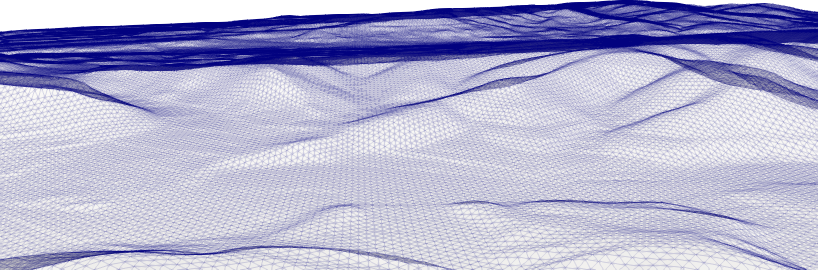
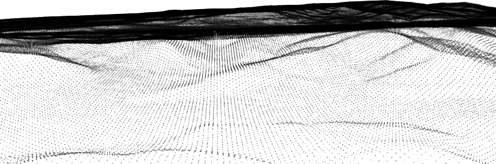
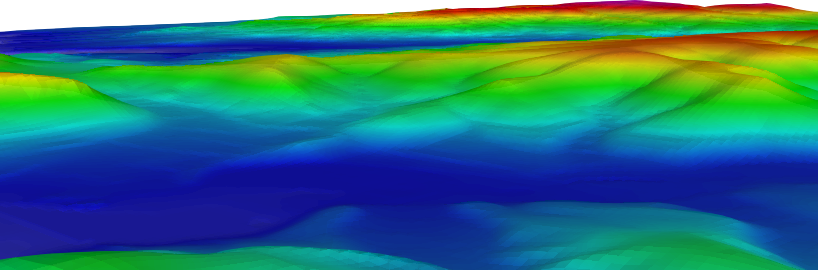

  

# Introduction

topIIvol meshing tool provides sequential/parallel tools for creating volumetric tetrahedral meshes from a given topology (point-cloud `*.xyz`). The volumetric meshes can be extracted in Gmsh's `*.msh` format or medit's `*.mesh` format.  The framework is written in C++, and uses MPI I/O and MPI for parallelization. One could produce distributed meshes suitable for domain-decomposition based solvers or simply non distributed meshes (single mesh) suitable for a sequential/parallel solver.

topIIvol consists a total of four tools:

### 1. `topIIvol_PreProc`

This tool is a point-cloud preprocessor. Often point-cloud data is huge and requires some alterations. This tool takes in a point-cloud as an input (`.xyz`). It can be used to coarsen a structured point cloud, by skipping a specified n number of points.


### 2. `topIIvol_Mesher`

This is a sequential computing tool. This tool takes in a point-cloud as an input (`.xyz`) and generates volumetric meshes that can be extracted in Gmsh's `*.msh` format or medit's `*.mesh` and `*.meshb` format.


### 3. `topIIvol_ParMesher`

This is a parallel computing tool. This tool takes in a point-cloud as an input (`.xyz`) and generates volumetric meshes that can be extracted in  medit's `*.mesh` format.


### 4. `topIIvol_DistMesher`

This is a tool to create embarrassingly parallel distributed meshes. The mesher takes in a point-cloud as an input (`.xyz`) and outputs distributed mesh.

## Installation process ##

Before you begin installing topIIvol please check if your system meets the dependencies.

**Dependencies**

- [automake](https://www.gnu.org/software/automake/)
- [C++](http://www.cplusplus.com/)
- [MPI](https://www.mcs.anl.gov/research/projects/mpi/)

**Now that I have all the dependencies what next**

Goto `top-ii-vol-Source` folder and

- step 1
```bash
autoreconf -i
```

- step 2
```bash
./configure 
```
*Note*:   `./configure` will install topIIvol in `/usr/local/bin` or `/usr/bin`, you generally need to be a superuser (sudoer) to have access to these directories. If you prefer to install at any other directory of choice `--prefix=Your/Own/Path` with `./configure`:

```bash
./configure --prefix=Your/Own/Path 
```

- step 3
```bash
make
```

- step 4
```bash
make check
```

- step 5
```bash
sudo make install
```
*Note*: if you used `--prefix` during the configure phase, you can avoid using `sudo` for this step and simply `make install`.

- Step 6 (optional)

```bash
make tutorials
```

this will install some basic tutorial at `$HOME/topIIvol-tutorials`.


## Running topIIvol

If the compilation went successful you should have three tools at your disposal `topIIvol_ParMesher`, `topIIvol_Mesher`,  `topIIvol_PreProc`, and `topIIvol_DistMesher`. These tools can be worked with command line inputs. Normally, these tools should be present in `/usr/local/bin` or `/usr/bin` folder, or else if you used `--prefix=your/directory` at the time of configure then these tools should be present in `your/directory/bin`. 


##### How to use topIIvol_PreProc ?

- If you wish to coarsen your mesh by skipping 10 points in x and y direction 

  ```bash
  topIIvol_PreProc --xpoints 500 --ypoints 451 --xskip 10 --yskip 10 \
  --in ./../etc/DEM_10m.xyz --out out-coarse.xyz
  ```

*Command-line option definitions*

| Option      | Type       | Comment                                                      |
| ----------- | ---------- | :----------------------------------------------------------- |
| `--xpoints` | `[int]`    | These are # of x points present in your point cloud.         |
| `--ypoints` | `[int]`    | These are # of y points present in your point cloud.         |
| `--xskip`   | `[int]`    | These are # of periodic x points you would like to skip.     |
| `--yskip`   | `[int]`    | These are # of periodic y points you would like to skip.     |
| `--in`      | `[string]` | Sting to provide the input point cloud file `.xyz`           |
| `--out`     | `[string]` | Sting to provide the  output coarsened/stripped point cloud file `.xyz` |

*Note that after successfully running `./topIIvol_PreProc`there will be a  info file `info-<out-coarse.xyz>.txt` that give the number of x an y points in the coarsened mesh cloud.*

##### How to use topIIvol_Mesher ?

This is the sequential mesher 

- For  sequential mesher producing  `*.mesh` mesh.

  ```bash
  topIIvol_Mesher --xpoints 32 --ypoints 29 --zpoints 15 --depth -1000 \
  --in ./../etc/DEM_160m.xyz --out out-mesh.mesh --mesh mesh
  ```
  
- For  sequential mesher producing  `*.msh` mesh.

  ```bash
  topIIvol_Mesher ---xpoints 32 --ypoints 29 --zpoints 15 --depth -1000 \
  --in ./../etc/DEM_160m.xyz --out out-mesh.msh  --mesh msh
  ```

*Command-line option definitions*

| Option      | Type       | Comment                                              |
| ----------- | ---------- | :--------------------------------------------------- |
| `--xpoints` | `[int]`    | These are # of x points present in your point cloud. |
| `--ypoints` | `[int]`    | These are # of y points present in your point cloud. |
| `--zpoints` | `[int]`    | These are # of z points intended in the z direction. |
| `--in`      | `[string]` | Sting to provide the input point cloud file `.xyz`   |
| `--out`     | `[string]` | Sting to provide the  output mesh file  `.mesh`      |
| `--depth`   | `[int]`    | This is the depth of the mesh needed.                |
| `--mesh`    | `[string]` | To specify the kind of mesh needed                   |


##### How to use topIIvol_ParMesher ?

This is the parallel mesher (still under heavy development)

- For parallel mesher producing  `*.mesh` mesh with 2 MPI ranks.

```bash
mpirun -n 2 topIIvol_ParMesher --xpoints 32 --ypoints 29 --zpoints 15 \
--depth -2000 --in ./../etc/DEM_160m.xyz  --out Parallel-out-mesh.mesh
```

*Command-line option definitions*

| Option      | Type       | Comment                                              |
| ----------- | ---------- | :--------------------------------------------------- |
| `--xpoints` | `[int]`    | These are # of x points present in your point cloud. |
| `--ypoints` | `[int]`    | These are # of y points present in your point cloud. |
| `--zpoints` | `[int]`    | These are # of z points intended in the z direction. |
| `--in`      | `[string]` | Sting to provide the input point cloud file `.xyz`   |
| `--out`     | `[string]` | Sting to provide the  output mesh file  `.mesh`      |
| `-n`        | `[int]`    | Provide the # of MPI ranks.                          |


##### How to use topIIvol_DistMesher ?

This is  tool to created distributed mesh from  partitioned point cloud

- Examples 3D partitioning of distributed mesher producing  `*.mesh` mesh with 24 MPI ranks (with 24 subdomains divided between x, y and z directions):

```bash
mpirun -n 24 topIIvol_DistMesher --zpoints 50 --xpoints 32 --ypoints 29 \
--depth -1000 --partition_x 2 --partition_y 3 --partition_z 4 \
--out top-ii-vol-mesh  --in ./../etc/DEM_160m 
```
or 
```bash
mpirun -n 24 topIIvol_DistMesher  --zpoints 50 --xpoints 32 --ypoints 29 \
--depth -1000 --partition_x 3 --partition_y 2 --partition_z 4 \
--out top-ii-vol-mesh  --in ./../etc/DEM_160m 
```
or
```bash
mpirun -n 24 topIIvol_DistMesher  --zpoints 50 --xpoints 32 --ypoints 29 \
--depth -1000 --partition_x 2 --partition_y 2 --partition_z 6 \
--out top-ii-vol-mesh  --in ./../etc/DEM_160m
```

- Examples 2D partitioning of distributed mesher producing  `*.mesh` mesh with 8 MPI ranks (with the 8 subdomains divided between x and y directions):

```bash
mpirun -n 8 topIIvol_DistMesher --zpoints 50 --xpoints 32 --ypoints 29 \
--depth -1000 --partition_x 2 --partition_y 4 --partition_z 1 \
--out top-ii-vol-mesh  --in ./../etc/DEM_160m 
```
or
```bash
mpirun -n 8 topIIvol_DistMesher --zpoints 50 --xpoints 32 --ypoints 29 \
--depth -1000 --partition_x 4 --partition_y 2 --partition_z 1 \
--out top-ii-vol-mesh  --in ./../etc/DEM_160m 
```

- Examples 2D partitioning of distributed mesher producing  `*.mesh` mesh with 6 MPI ranks (with the 6 subdomains divided between x and z directions):


```bash
mpirun -n 6 topIIvol_DistMesher --zpoints 50 --xpoints 32 --ypoints 29 \
--depth -1000 --partition_x 2 --partition_y 1 --partition_z 3 \
--out top-ii-vol-mesh  --in ./../etc/DEM_160m 
```
or
```bash
mpirun -n 6 topIIvol_DistMesher --zpoints 50 --xpoints 32 --ypoints 29 \
--depth -1000 --partition_x 3 --partition_y 1 --partition_z 2 \
--out top-ii-vol-mesh  --in ./../etc/DEM_160m 
```

- Examples 2D partitioning of distributed mesher producing  `*.mesh` mesh with 16 MPI ranks (with the 16 subdomains divided between y and z directions):


```bash
mpirun -n 16 topIIvol_DistMesher --zpoints 50 --xpoints 32 --ypoints 29 \
--depth -1000 --partition_x 1 --partition_y 8 --partition_z 2 \
--out top-ii-vol-mesh  --in ./../etc/DEM_160m 
```
or
```bash
mpirun -n 16 topIIvol_DistMesher --zpoints 50 --xpoints 32 --ypoints 29 \
--depth -1000 --partition_x 1 --partition_y 2 --partition_z 8 \
--out top-ii-vol-mesh  --in ./../etc/DEM_160m 
```
or
```bash
mpirun -n 16 topIIvol_DistMesher --zpoints 50 --xpoints 32 --ypoints 29 \
--depth -1000 --partition_x 1 --partition_y 4 --partition_z 4 \
--out top-ii-vol-mesh  --in ./../etc/DEM_160m 
```

- Examples 1D partitioning of distributed mesher producing  `*.mesh` mesh with 4 MPI ranks (letting the algorithm decide the partition direction): 

```bash
mpirun -n 4 topIIvol_DistMesher --zpoints 50 --xpoints 32 --ypoints 29 \
--depth -1000 --out top-ii-vol-mesh  --in ./../etc/DEM_160m
```

- Examples 1D partitioning of distributed mesher producing  `*.mesh` mesh with 4 MPI ranks (enforced partitioning in x direction): 

```bash
mpirun -n 4 topIIvol_DistMesher  --zpoints 50 --xpoints 32 --ypoints 29 \
--depth -1000 --partition_x 4 --partition_y 1 --partition_z 1 \
--out top-ii-vol-mesh  --in ./../etc/DEM_160m 
```

- Examples 1D partitioning of distributed mesher producing  `*.mesh` mesh with 8 MPI ranks (enforced partitioning in y direction): 

```bash
mpirun -n 8 topIIvol_DistMesher  --zpoints 50 --xpoints 32 --ypoints 29 \
--depth -1000 --partition_x 1 --partition_y 8 --partition_z 1 \
--out top-ii-vol-mesh  --in ./../etc/DEM_160m 
```

- Examples 1D partitioning of distributed mesher producing  `*.mesh` mesh with 3 MPI ranks (enforced partitioning in z direction): 

```bash
mpirun -n 3 topIIvol_DistMesher  --zpoints 50 --xpoints 32 --ypoints 29 \
--depth -1000 --partition_x 1 --partition_y 1 --partition_z 3 \
--out top-ii-vol-mesh  --in ./../etc/DEM_160m 
```


*Command-line option definitions*

| Option            | Type       | Comment                                                     |
| ------------------| ---------- | :---------------------------------------------------------- |
| `--xpoints`       | `[int]`    | These are # of x points present in your point cloud.        |
| `--ypoints`       | `[int]`    | These are # of y points present in your point cloud.        |
| `--zpoints`       | `[int]`    | These are # of z points intended in the z direction.        |
| `--partition_x`   | `[int]`    | These are # of x partitions in x direction.                 |
| `--partition_y`   | `[int]`    | These are # of y partitions in y direction.                 |
| `--partition_z`   | `[int]`    | These are # of z partitions in z direction.                 |
| `--in`            | `[string]` | Sting to provide the input point cloud file `.xyz`          |
| `--out`           | `[string]` | Sting to provide the  output mesh file  `.mesh`             |
| `-np`             | `[int]`    | Provide the # of MPI ranks.                                 |


To report bugs, issues, feature-requests contact:* 

- **mohd-afeef.badri@cea.fr**
- **mohd-afeef.badri@hotmail.com**
- **mohd-afeef.badri@etu.univ-nantes.fr** 


## Point cloud ##



## Surface triangulation of point cloud ##


##  Finite element solution field ##

