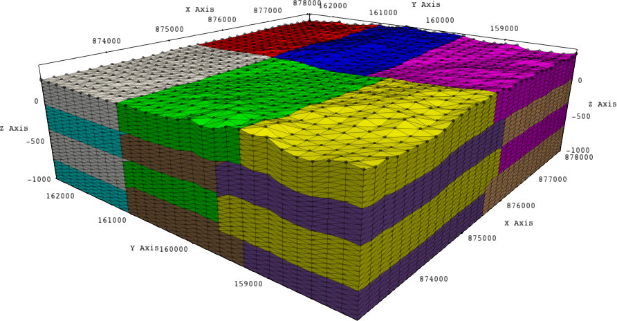

In this tutorial let us use `topIIvol_DistMesher` to create a volume mesh from a point cloud cluster `./xyz/point-cloud-coarse.xyz` which contains $(x\times y)=32 \times 29 = 928$ points. `topIIvol_DistMesher` is a parallel computing tool, it will takes in a point-cloud as an input (`.xyz`) and generate volumetric meshes (partitioned) that can be extracted in medit's `*.mesh` format. Simply, `topIIvol_DistMesher` is tool to created distributed mesh from a point cloud.

|  |
| :-----------------------------------------------: |
|   **Initial point cloud with 928 data points**    |


Let us say we would like to create the volumeteric mesh `top-ii-vol-mesh`, with volume stretching upto a depth ($z$) of $-1000$ and $z$ direction should be meshed with $50$ layers. Let us accomplish this task using 24 parallel processes (24 MPI ranks). 

- Let us highlight 3D partitioning of distributed mesher producing `*.mesh` mesh with 24 MPI ranks (with 24 subdomains divided between x, y and z directions). This can be achieved by: 

```bash
mpirun -n 24 topIIvol_DistMesher --zpoints 30 --xpoints 32 --ypoints 29 \
--depth -1000 --partition_x 2 --partition_y 3 --partition_z 4 \
--out top-ii-vol-mesh --in ./xyz/point-cloud-coarse
```
or 
```bash
mpirun -n 24 topIIvol_DistMesher --zpoints 30 --xpoints 32 --ypoints 29 \
--depth -1000 --partition_x 3 --partition_y 2 --partition_z 4 \
--out top-ii-vol-mesh --in ./xyz/point-cloud-coarse 
```
or
```bash
mpirun -n 24 topIIvol_DistMesher --zpoints 30 --xpoints 32 --ypoints 29 \
--depth -1000 --partition_x 2 --partition_y 2 --partition_z 6 \
--out top-ii-vol-mesh --in ./xyz/point-cloud-coarse
```

|  |
| :-----------------------------------------------: |
|   **3D partitioning: Mesh with 24 subdomains using (2,3,4) partitions in ($x,y,z$).**    |

|  |
| :-----------------------------------------------: |
|   **3D partitioning: Mesh with 24 subdomains using (3,2,4) partitions in ($x,y,z$).**    |

|  |
| :-----------------------------------------------: |
|   **3D partitioning: Mesh with 24 subdomains using (2,2,6) partitions in ($x,y,z$).**    |

Notice that in all the examples `--partition_x` times `--partition_y` times `--partition_z` is equal to 24. In other words we are setting work load distribution between 24 MPI processes. 

- Let us now highlight 2D partitioning of distributed mesher producing `*.mesh` mesh with 8 MPI ranks (with the 8 subdomains divided between x and y directions):

```bash
mpirun -n 8 topIIvol_DistMesher --zpoints 30 --xpoints 32 --ypoints 29 \
--depth -1000 --partition_x 2 --partition_y 4 --partition_z 1 \
--out top-ii-vol-mesh --in ./xyz/point-cloud-coarse 
```
or
```bash
mpirun -n 8 topIIvol_DistMesher --zpoints 30 --xpoints 32 --ypoints 29 \
--depth -1000 --partition_x 2 --partition_y 1 --partition_z 4 \
--out top-ii-vol-mesh --in ./xyz/point-cloud-coarse 
```
|  |
| :-----------------------------------------------: |
|   **2D partitioning: Mesh with 8 subdomains using (2,4,1) partitions in ($x,y,z$).**    |

|  |
| :-----------------------------------------------: |
|   **2D partitioning: Mesh with 8 subdomains using (2,1,4) partitions in ($x,y,z$).**    |

- Let us now highlight 2D partitioning of distributed mesher producing `*.mesh` mesh with 6 MPI ranks (with the 6 subdomains divided between x and z directions):


```bash
mpirun -n 6 topIIvol_DistMesher --zpoints 30 --xpoints 32 --ypoints 29 \
--depth -1000 --partition_x 2 --partition_y 1 --partition_z 3 \
--out top-ii-vol-mesh --in ./xyz/point-cloud-coarse 
```
or
```bash
mpirun -n 6 topIIvol_DistMesher --zpoints 30 --xpoints 32 --ypoints 29 \
--depth -1000 --partition_x 3 --partition_y 1 --partition_z 2 \
--out top-ii-vol-mesh --in ./xyz/point-cloud-coarse 
```

- Let us now highlight 2D partitioning of distributed mesher producing `*.mesh` mesh with 16 MPI ranks (with the 16 subdomains divided between y and z directions):


```bash
mpirun -n 16 topIIvol_DistMesher --zpoints 30 --xpoints 32 --ypoints 29 \
--depth -1000 --partition_x 1 --partition_y 8 --partition_z 2 \
--out top-ii-vol-mesh --in ./xyz/point-cloud-coarse 
```
or
```bash
mpirun -n 16 topIIvol_DistMesher --zpoints 30 --xpoints 32 --ypoints 29 \
--depth -1000 --partition_x 1 --partition_y 2 --partition_z 8 \
--out top-ii-vol-mesh --in ./xyz/point-cloud-coarse 
```
or
```bash
mpirun -n 16 topIIvol_DistMesher --zpoints 30 --xpoints 32 --ypoints 29 \
--depth -1000 --partition_x 1 --partition_y 4 --partition_z 4 \
--out top-ii-vol-mesh --in ./xyz/point-cloud-coarse 
```

- Let us now highlight 1D partitioning of distributed mesher producing `*.mesh` mesh with 4 MPI ranks (letting the algorithm decide the partition direction): 

```bash
mpirun -n 4 topIIvol_DistMesher --zpoints 30 --xpoints 32 --ypoints 29 \
--depth -1000 --out top-ii-vol-mesh --in ./xyz/point-cloud-coarse
```

|  |
| :-----------------------------------------------: |
|   **1D partitioning: Mesh with 8 subdomains using 1D partitioning.**    |

Note that we did not provide `--partition_x` , `--partition_y` or `--partition_z` flags to the mesher, it automatically determines that there are more points in $x$ direction ($32>30>29$)and partitioning is performed in $x$.


- Let us now highlight 1D of distributed mesher producing `*.mesh` mesh with 8 MPI ranks (enforced partitioning in x direction): 

```bash
mpirun -n 4 topIIvol_DistMesher --zpoints 30 --xpoints 32 --ypoints 29 \
--depth -1000 --partition_x 1 --partition_y 1 --partition_z 8 \
--out top-ii-vol-mesh --in ./xyz/point-cloud-coarse 
```

|  |
| :-----------------------------------------------: |
|   **1D partitioning: Mesh with 8 subdomains using forced 1D partitioning.**    |

- Let us now highlight 1D partitioning of distributed mesher producing `*.mesh` mesh with 8 MPI ranks (enforced partitioning in y direction): 

```bash
mpirun -n 8 topIIvol_DistMesher --zpoints 30 --xpoints 32 --ypoints 29 \
--depth -1000 --partition_x 1 --partition_y 8 --partition_z 1 \
--out top-ii-vol-mesh --in ./xyz/point-cloud-coarse 
```

- Let us now highlight 1D partitioning of distributed mesher producing `*.mesh` mesh with 3 MPI ranks (enforced partitioning in z direction): 

	
```bash
mpirun -n 3 topIIvol_DistMesher --zpoints 30 --xpoints 32 --ypoints 29 \
--depth -1000 --partition_x 1 --partition_y 1 --partition_z 3 \
--out top-ii-vol-mesh --in ./xyz/point-cloud-coarse 
```

### What else is there to try ###

The 3D distributed mesher is a tool suitable for exascale computing, it has been tested to produce meshes with over 12 Billion nodes and 67 Billion tetrahedra in less than 5 minutes. Scaling of this tool Intel Skylake nodes on Inti supercomputer, hosted at TGCC is shown below. 

|              |
| :----------------------------------------------------------: |
| **Benchmarking scaling of topIIvol_DistMesher on Skylake CPU architecture on Inti** |

Try reproducing such large meshes on a supercomputer of choice. And try confirm the quasi optimal scaling characteristics of `topIIvol_DistMesher` on your supercomputer. 

To report bugs, issues, feature-requests contact:* 

- **mohd-afeef.badri@cea.fr**
- **mohd-afeef.badri@hotmail.com**
