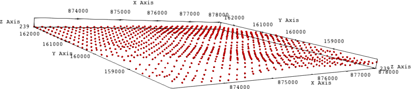
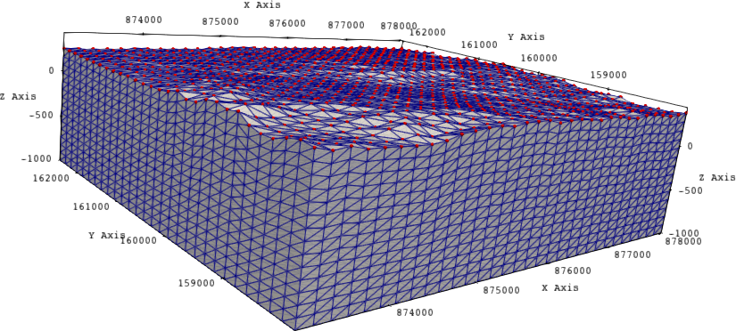
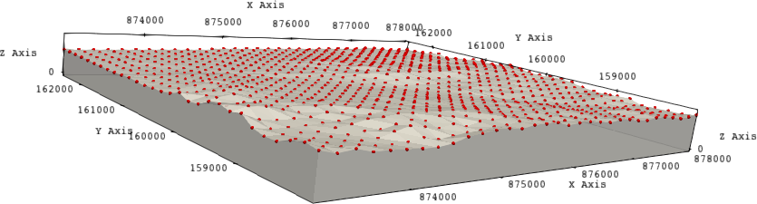
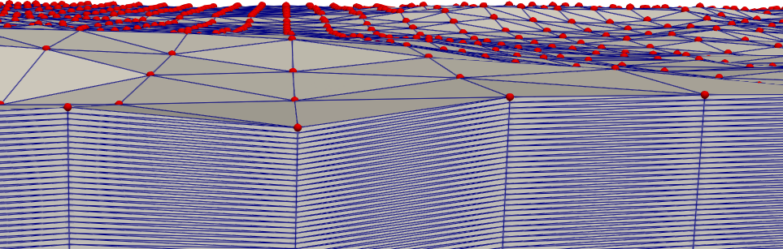
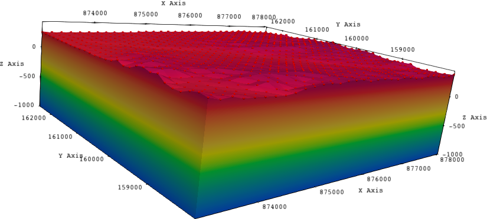

In this tutorial  let us use `topIIvol_Mesher` to create a volume mesh from  a point cloud cluster `./xyz/point-cloud-coarse.xyz` which contains $(x\times y)=32 \times 29 = 928$ points. `topIIvol_Mesher` is a sequential computing tool, it will takes  in a point-cloud as an input (`.xyz`) and generates volumetric meshes that can be extracted in Gmsh's `*.msh` format or medit's  `*.mesh` format. Let us say we would like to create the volumeteric mesh `out-mesh.mesh`, with volume stretching upto a depth ($z$) of $-1000$ and $z$ direction should be meshed with $15$ layers. 

To perform the meshing run the following in terminal:

```bash
topIIvol_Mesher --xpoints 32 --ypoints 29 --zpoints 15 --depth -1000 \
--in ./xyz/point-cloud-coarse.xyz --out out-mesh.mesh --mesh mesh
```

|  |
| :-----------------------------------------------: |
|   **Initial point cloud with 928 data points**    |

|  |
| :----------------------------------------------: |
| **Volumeteric mesh generated from point cloud**  |

Let us now create a mesh in which the volume stretches only upto $-30$ in $z$ direction instead of $-1000$. This can be accomplished by using `--depth -30` instead of `--depth -1000`. Run the following in terminal:

```bash
topIIvol_Mesher --xpoints 32 --ypoints 29 --zpoints 15 --depth -30 \
--in ./xyz/point-cloud-coarse.xyz --out out-mesh.mesh --mesh mesh
```

|              |
| :----------------------------------------------------------: |
| **Volumeteric mesh generated from point cloud with shallow depth** |

Additionally, let us create a volumetric mesh in which volume stretches upto  $-30$ in $z$ direction and contains  $100$ layers in $z$. Run the following in terminal:

```bash
topIIvol_Mesher --xpoints 32 --ypoints 29 --zpoints 100 --depth -30 \
--in ./xyz/point-cloud-coarse.xyz --out out-mesh.mesh --mesh mesh
```

|              |
| :----------------------------------------------------------: |
| **Volumeteric mesh generated from point cloud with fine layering** |


### What else is there to try ###

- In all the above three tutorials we saved the output mesh in `.mesh` format, to save the mesh in `.msh` format simply replace  the flag `--mesh mesh` with `--mesh msh`. As such you should run 

```bash
topIIvol_Mesher --xpoints 32 --ypoints 29 --zpoints 15 --depth -1000 \
--in ./xyz/point-cloud-coarse.xyz --out out-mesh.mesh --mesh msh
```

```bash
topIIvol_Mesher --xpoints 32 --ypoints 29 --zpoints 15 --depth -30 \
--in ./xyz/point-cloud-coarse.xyz --out out-mesh.mesh --mesh msh
```

```bash
topIIvol_Mesher --xpoints 32 --ypoints 29 --zpoints 100 --depth -30 \
--in ./xyz/point-cloud-coarse.xyz --out out-mesh.mesh --mesh msh
```

- You can try running these meshes with some finite element software e.g, try a simple Laplace equation with these meshes with. 

|  |
| :-----------------------------------------------: |
|         **Laplace solution on the mesh**          |

*To report bugs, issues, feature-requests contact:* 

- **mohd-afeef.badri@cea.fr**
- **mohd-afeef.badri@hotmail.com**
